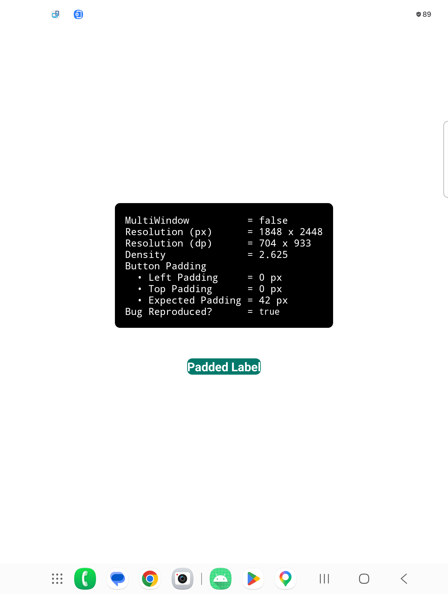
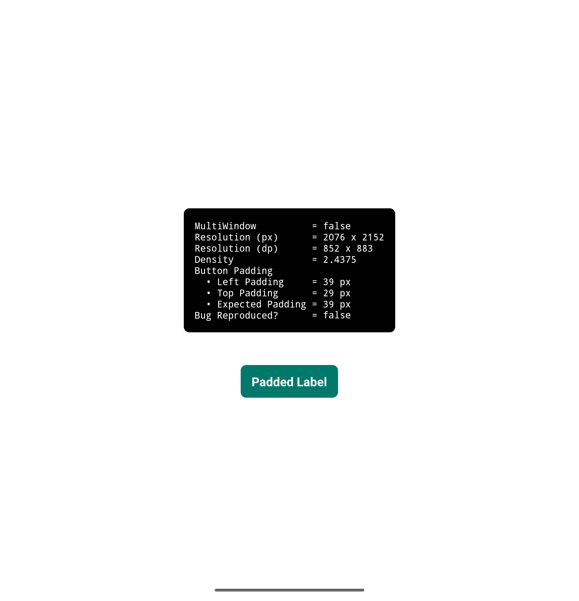

# Samsung Padding Loss

XML-declared padding is silently zeroed on **Samsung** devices when the app window is wider than
a regular phone — such as a foldable's unfolded inner display. Confirmed on **Galaxy Z Fold 8**,
**Z Fold 7** and **Galaxy Tab S9**. Stock Android is unaffected.

> **This is the `fix-example` branch** — the same app with the fix applied, so it reads
> `Bug Reproduced? = false` on an affected Samsung device.
> [See the full diff against `main`](https://github.com/akexorcist/samsung-padding-loss/compare/main...fix-example).

## Cause

Two things together:

1. `android:fitsSystemWindows="true"` set at the **theme/window level**
2. A **Samsung** device, with a window **wider than a regular phone**

Either alone is fine — the same build reads correct padding when folded. Together they zero
`paddingHorizontal` and `paddingVertical` declared in XML. A bare `LinearLayout` is enough; no
custom view or design-system component involved.

## Reproduce

1. Install on a Z Fold 8 or Z Fold 7.
2. Unfold and launch on the inner display.
3. Read the on-screen panel, or `adb logcat -s SamsungPaddingLoss`.

```
MultiWindow          = false
Resolution (px)      = 1848 x 2448
Resolution (dp)      = 704 x 933
Density              = 2.625
Button Padding
  • Left Padding     = 0 px
  • Top Padding      = 0 px
  • Expected Padding = 42 px
Bug Reproduced?      = true
```

`Bug Reproduced? = true` means the row's measured padding no longer matches what its XML
declares. Folded, the same build reads `false`.

👇 Reproduced on a Samsung device:



👇 Not reproduced on other devices, e.g. a Google Pixel:



> **Not foldable-specific.** A Galaxy Tab S9 reproduces it too, in freeform or multi-window,
> once the window is wider than a regular phone.

## Fix

Remove `android:fitsSystemWindows="true"` from the theme and handle insets with
`WindowCompat.setDecorFitsSystemWindows` plus an `OnApplyWindowInsetsListener` on the specific
views that need it.

Applied here in two places:

- `res/values/themes.xml` — the theme no longer sets `android:fitsSystemWindows`
- `MinimalActivity.applySystemBarInsets()` — adds the system bar insets on top of the root's
  declared padding, scoped to that one view

## Build

```
./gradlew :app:assembleDebug
```

## License

Apache License 2.0 — see [LICENSE](LICENSE). Copyright 2026 Akexorcist.
